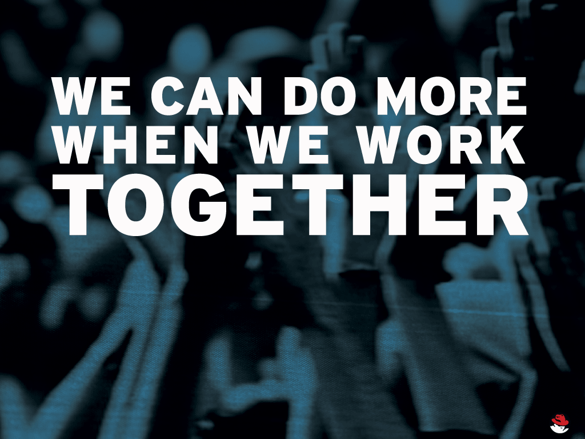
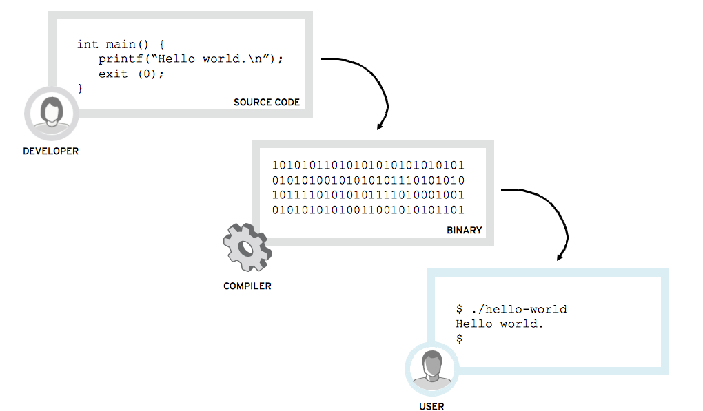
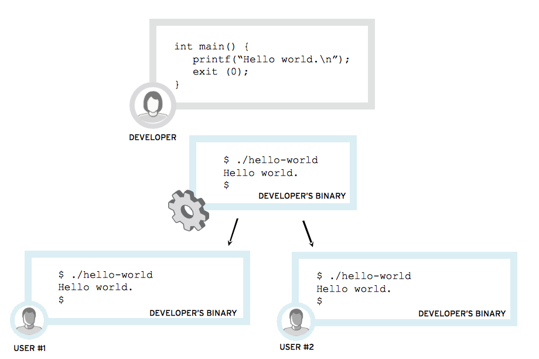
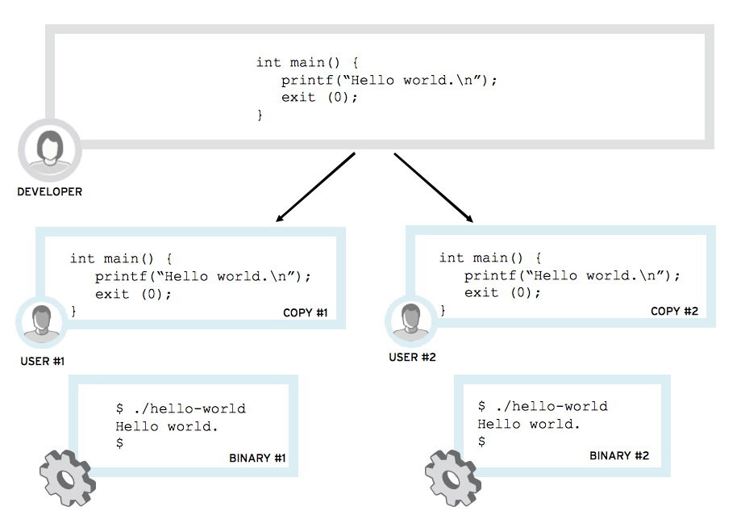
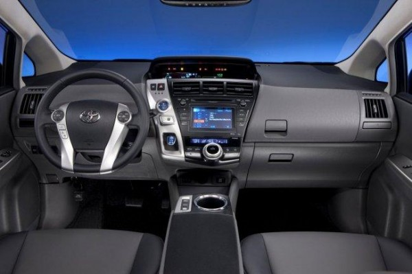
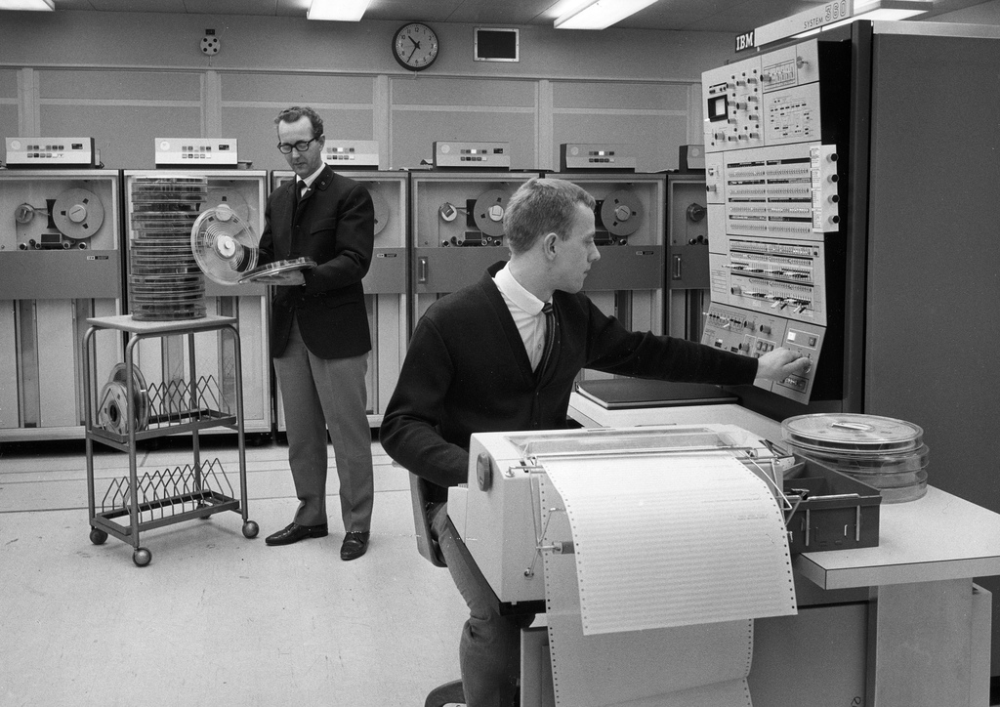
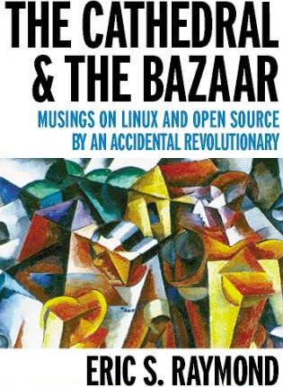

# Open Source #
## Freedom is a Feature ##

Gunnar Hellekson 
Chief Technology Strategist, Red Hat US Public Sector 
@ghelleks • +1 202 507 9027 • gunnar.hellekson@redhat.com 
http://atechnologyjobisnoexcuse.com/ 
 
24 July 2012

---

# Housekeeping #

## Ask questions whenever you like. ##

## Get up whenever you like. ##

## Turn off your ringer. ##

---

# Here We Go. #

##What is open source, anyway?##
What this process is, and where you can find it in your everyday life.

##Where did it start?##
A brief history of nerds changing the world.

##How does it work?##
The mechanics of freedom.

##How can I use it?##
Some practical advice.

.notes: Make sure that is what the audience wants to hear.

---

# The Open Source Way #

##Create.##

##Collaborate.##

##Share.##

##Let everyone else do the same.##

.notes: It's not scary. Your mother was right: it's nice to share.

---

---

# The Basics #

---

# How Development Works #

---

# Selling Binaries #

---

# Sharing Code #

---

# Open Source is Everywhere #

---

# Mobile Phones #

---
# Stock Exchanges #

---
# Automobiles #

---
# Weather #

---
# Airplanes #

---
# A Brief History of Open Source #

---
# Anarchists #

---
# Communists #

---
# RMS #

---
# The Printer Problem #

---
# GNU's Not Unix #

---
# Four Freedoms #

## Free to use. ##
Anyone can use it, however they like.

## Free to copy. ##
Anyone can get a copy for the cost of media.

## Free to modify. ##
If I don’t like how it works, I can change it.

## Free to distribute. ##
I can share my changes.

---
# GNU Public License #

## Implements the four freedoms. ##
Use, copy, modify, distribute.

## Built on copyright. ##
The author provides additional rights for additional responsibilities.

## In some cases, problematic. ##
But more on that later.

---
# Linux is Born #

    From: torvalds@klaava.Helsinki.FI (Linus Benedict Torvalds)
    Newsgroups: comp.os.minix
    Subject: What would you like to see most in minix?
    Message-ID: <1991Aug25.205708.9541@klaava.Helsinki.FI>
    Date: 25 Aug 91 20:57:08 GMT
    Organization: University of Helsinki
    
    I'm doing a (free) operating system (just a hobby, won't be big and 
    professional like gnu) for 386(486) AT clones. This has been brewing 
    since april, and is starting to get ready. I'd like any feedback on 
    things people like/dislike in minix...

---
# ESR #

http://catb.org/esr/writings/cathedral-bazaar/

---
# OPEN SOURCE GROWTH #

---

